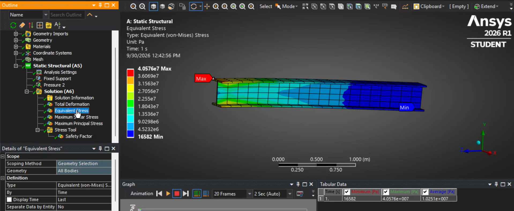
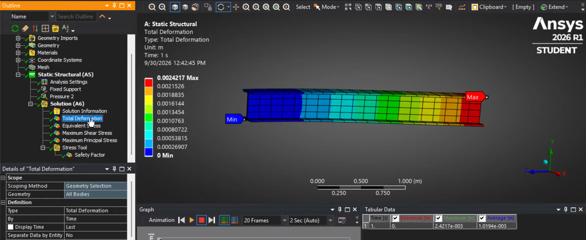
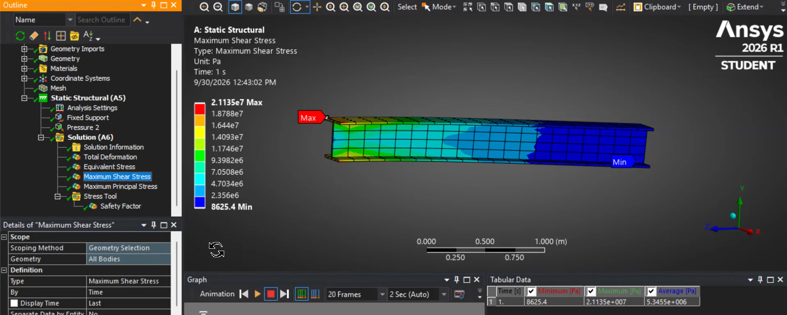
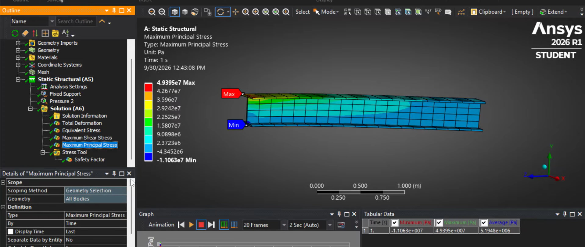
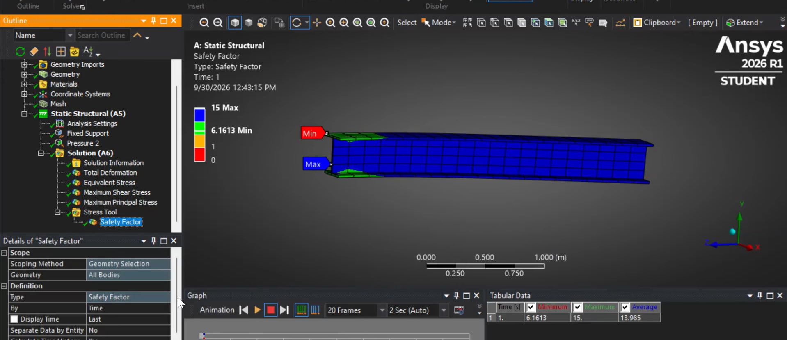

# Cantilever I-Beam Under Trapezoidal Load: Safety Factor

**DME Assignment, Problem 14**: analytical hand calculation vs. **ANSYS Mechanical 2026 R1** (Static Structural).

A 3 m cantilever I-beam carries a linearly varying (trapezoidal) distributed load. The aim is to find the maximum stress, maximum shear stress, safety factor and tip deflection, and to compare the hand calculation with the FEA result.

---

## Problem Statement

A **3 m cantilever I-beam** of ductile structural steel is fixed at the wall at end **B** and free at end **A**. It carries a trapezoidal load of **12 kN/m at the free end A** rising to **18 kN/m at the fixed end B**.

| Parameter | Value |
|---|---:|
| Beam length, L | 3 m |
| Load at free end A | 12 kN/m |
| Load at fixed end B | 18 kN/m |
| Flanges | 250 × 20 mm |
| Web thickness | 20 mm |
| Overall depth | 340 mm |
| Material | Structural steel |
| Yield strength, σ_yt | 250 MPa |
| Young's modulus, E | 200 GPa |
| Analysis | Static Structural |
| Software | ANSYS Mechanical 2026 R1 |

---

## Repository Structure

```text
Cantilever_Beam_Simulation/
├── AnsysSimulationFiles/              # ANSYS Workbench project
├── HandWritten/                       # Handwritten calculation
├── SOLID_MODEL/                       # CAD model of the I-beam
├── Simulation_Video/                  # Screen recording of the simulation
├── Imgs/                              # Result images used in this README
├── cantilever_calc.py                 # Python check of the hand calculation
├── Problem14_Handwritten_vs_ANSYS.pptx
└── README.md
```

---

## Load Modelling in ANSYS

The trapezoidal load is applied as a **tabular pressure** on the 250 mm wide top face:

$$p = \frac{w}{b}, \qquad b = 0.25\ \text{m}$$

$$p_A = \frac{12\,000}{0.25} = 48\ \text{kPa}, \qquad p_B = \frac{18\,000}{0.25} = 72\ \text{kPa}$$

The pressure varies linearly from **48 kPa (free end A) to 72 kPa (fixed end B)**.

---


## ANSYS Simulation

**Workflow:** Geometry → Material assignment → Fixed support at B → Tabular pressure on top face → Mesh → Solve → Post-processing

- **Boundary condition:** end face at B fully fixed.
- **Load:** linearly varying pressure on the top face, 48 kPa at A to 72 kPa at B.
- **Material:** Structural Steel, σ_yt = 250 MPa.

---

## Simulation Results

### Equivalent (von Mises) stress



**Figure 1:** Equivalent von Mises stress. The maximum, **σ_vm ≈ 40.58 MPa**, occurs near the fixed end where the bending moment is greatest.

### Total deformation



**Figure 2:** Total deformation. The maximum, **δ_max ≈ 2.42 mm**, is at the free end, as expected for a cantilever.

### Maximum shear and principal stress

<table>
<tr>
<td align="center">

<br>
<b>Figure 3: Maximum shear stress</b>
</td>
<td align="center">

<br>
<b>Figure 4: Maximum principal stress</b>
</td>
</tr>
</table>

Maximum shear stress from ANSYS: **τ_max ≈ 21.14 MPa**.

### Safety factor



**Figure 5:** Safety factor distribution. Minimum safety factor from ANSYS: **n ≈ 6.16**.

---

## Hand Calculation vs. ANSYS

| Quantity | Hand Calculation | ANSYS | Difference |
|---|---:|---:|---:|
| Max bending / von Mises stress | 40.62 MPa | 40.58 MPa | -0.1% |
| Max shear stress (Tresca) | 20.31 MPa | 21.14 MPa | +4.1% |
| Safety factor | 6.15 | 6.16 | +0.2% |
| Max deformation | n/a | 2.42 mm | n/a |
| Critical region | Fixed end B | Fixed end B | same |

The hand calculation and ANSYS agree closely on stress and safety factor, and both identify the fixed end as the critical location.

---

## Possible Sources of Small Differences

1. **Fixed-support effects.** A perfectly rigid support in a 3D model creates a local stress concentration at the wall, and the peak nodal value depends on the mesh.
2. **3D vs. beam theory.** ANSYS solves the full solid, while Euler-Bernoulli theory assumes plane sections remain plane.
3. **Load application.** The load is applied as pressure over a finite surface rather than as an ideal line load.
4. **Discretisation.** Results depend on element type, size and mesh quality.

---

## Conclusion

- Hand calculation: σ_max = 40.62 MPa, τ_max = 20.31 MPa, n = 6.15 (von Mises and Tresca).
- ANSYS: σ_vm = 40.58 MPa, τ_max = 21.14 MPa, n = 6.16, δ_max = 2.42 mm.
- The two methods agree closely, and the fixed end B is the critical location.
- The beam is safe, with a safety factor of about 6 to 7.
- The handwritten moment uses a 2 m arm for the triangular load; the correct arm is 1 m, giving M_B = 63 kN·m, σ = 35.54 MPa and n = 7.03 (see *Known Error in the Handwritten Solution*).

---

## Tools

- ANSYS Mechanical 2026 R1 (Workbench, Static Structural)
- Python 3 (verification script)
